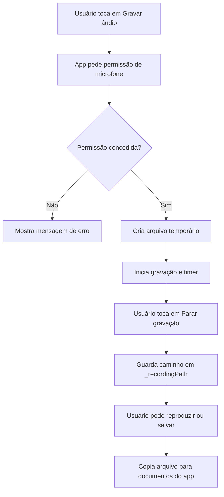

# Lab 08 - Estudo aprofundado do app Gravador

## Para consultar durante o laboratório

* [Pacote record](https://pub.dev/packages/record)
* [Pacote audioplayers](https://pub.dev/packages/audioplayers)
* [Pacote path_provider](https://pub.dev/packages/path_provider)
* [Pacote permission_handler](https://pub.dev/packages/permission_handler)
* [StatefulWidget](https://api.flutter.dev/flutter/widgets/StatefulWidget-class.html)
* [Timer](https://api.dart.dev/stable/dart-async/Timer-class.html)

Disciplina: Tecnologia e Programação para Dispositivos Móveis (TPDM)  
Curso: Engenharia de Software - PUC-Campinas  
Professor: Prof. Me. Mateus Dias  
Duração sugerida: 2 h/a a 3 h/a

## Objetivos do Lab

Ao final deste laboratório, o estudante deverá ser capaz de:

* Ler e explicar o funcionamento de um app Flutter já implementado;
* Identificar o papel das dependências externas usadas pelo projeto;
* Entender como o app solicita permissão de microfone;
* Explicar o fluxo de gravação, reprodução e salvamento de áudio;
* Diferenciar arquivo temporário de arquivo persistente;
* Relacionar variáveis de estado com mudanças visuais na interface;
* Avaliar pontos de melhoria no código e na experiência do usuário.

## App base deste laboratório

Use como objeto principal de estudo o app:

```text
exemplos/app_gravador/gravador
```

O arquivo principal está em:

```text
exemplos/app_gravador/gravador/lib/main.dart
```

Antes de alterar qualquer código, execute o app, use suas funcionalidades e observe seu comportamento.

## O que este estudo propõe

Neste laboratório, o objetivo principal não é copiar código novo. A proposta é fazer uma leitura cuidadosa do aplicativo gravador e produzir uma análise técnica sobre como ele funciona.

O app permite:

* solicitar permissão de microfone;
* gravar áudio em arquivo `.m4a`;
* mostrar o tempo de gravação;
* reproduzir a gravação feita;
* salvar uma cópia da gravação na pasta de documentos do aplicativo;
* limpar a tela para iniciar uma nova gravação.

Ideia central do lab: estudar código também é uma competência de engenharia. Antes de evoluir uma aplicação, precisamos entender seu fluxo, seus estados, suas dependências e suas decisões de implementação.

## Pré-requisitos

* Ter o Flutter configurado e funcionando;
* Conseguir executar apps Flutter em emulador ou dispositivo físico;
* Ter acesso a microfone no ambiente de teste;
* Saber navegar pelos arquivos do projeto no VS Code ou Android Studio;
* Conhecer conceitos básicos de `StatefulWidget`, `setState` e `async/await`.

## Parte A - Executando e observando o app

No terminal, acesse a pasta do app:

```bash
cd exemplos/app_gravador/gravador
```

Baixe as dependências:

```bash
flutter pub get
```

Execute o app:

```bash
flutter run
```

Depois de abrir o aplicativo, teste o seguinte fluxo:

1. Toque em **Gravar áudio**;
2. Autorize o uso do microfone;
3. Grave alguns segundos de áudio;
4. Toque em **Parar gravação**;
5. Toque em **Reproduzir**;
6. Toque em **Salvar**;
7. Toque em **Nova gravação**.

### Tarefa conceitual

Responda com suas palavras:

* O que acontece visualmente quando a gravação começa?
* Quais botões ficam habilitados ou desabilitados durante o uso?
* Em que momento o caminho do arquivo salvo aparece na tela?
* O comportamento observado combina com o código em `main.dart`?

## Parte B - Mapeando as dependências

Abra o arquivo:

```text
exemplos/app_gravador/gravador/pubspec.yaml
```

Observe as dependências principais:

```yaml
record: ^6.2.0
audioplayers: ^6.6.0
path_provider: ^2.1.5
permission_handler: ^12.0.1
```

### Tarefa conceitual

Monte uma tabela explicando o papel de cada dependência no app.

Modelo sugerido:

| Dependência | Papel no app | Onde aparece no código |
| --- | --- | --- |
| `record` | ... | ... |
| `audioplayers` | ... | ... |
| `path_provider` | ... | ... |
| `permission_handler` | ... | ... |

Depois responda:

* Por que o Flutter precisa de pacotes externos para gravar e reproduzir áudio?
* Qual dependência está relacionada com permissões do sistema operacional?
* Qual dependência permite encontrar diretórios do dispositivo?

## Parte C - Entendendo a estrutura geral do app

No arquivo `main.dart`, identifique:

* a função `main`;
* o widget `GravadorApp`;
* o widget `GravadorPage`;
* a classe `_GravadorPageState`;
* o método `build`.

### Tarefa conceitual

Explique a responsabilidade de cada parte:

* O que a função `main` faz?
* Por que `GravadorApp` pode ser um `StatelessWidget`?
* Por que `GravadorPage` precisa ser um `StatefulWidget`?
* Qual é o papel da classe `_GravadorPageState`?
* O que o método `build` constrói?

## Parte D - Estudando o estado da tela

Localize as variáveis de estado dentro de `_GravadorPageState`:

```dart
AudioRecorder? _recorder;
AudioPlayer? _player;
Timer? _timer;
String? _recordingPath;
String? _savedPath;
Duration _recordingDuration = Duration.zero;
bool _isRecording = false;
bool _isPlaying = false;
```

### Tarefa conceitual

Para cada variável, responda:

* O que ela guarda?
* Em quais métodos ela é alterada?
* Como ela influencia a interface?

Depois explique:

* Qual é a diferença entre `_recordingPath` e `_savedPath`?
* Por que `_isRecording` e `_isPlaying` são booleanos?
* Por que o app precisa guardar `_recordingDuration`?

## Parte E - Fluxo de gravação

Estude o método:

```dart
Future<void> _startRecording() async
```

Observe especialmente:

* solicitação de permissão de microfone;
* parada de áudio em reprodução;
* criação do arquivo temporário;
* configuração do `AudioRecorder`;
* uso de `RecordConfig`;
* início do `Timer`;
* chamada de `setState`.

### Tarefa conceitual

Descreva, em formato de passo a passo, tudo que acontece quando o usuário toca em **Gravar áudio**.

Inclua na sua explicação:

* O que acontece se a permissão do microfone for negada?
* Onde o arquivo inicial da gravação é criado?
* Por que o nome do arquivo usa `DateTime.now().millisecondsSinceEpoch`?
* Por que o cronômetro usa `Timer.periodic`?
* Por que é necessário chamar `setState`?

## Parte F - Parando a gravação

Estude o método:

```dart
Future<void> _stopRecording() async
```

### Tarefa conceitual

Responda:

* O que o método `stop()` do gravador devolve?
* Por que o timer precisa ser cancelado?
* O que muda na tela depois que `_isRecording` vira `false`?
* Por que o app mostra uma mensagem quando `path != null`?

## Parte G - Reprodução do áudio

Estude os métodos:

```dart
Future<void> _playRecording() async
Future<void> _stopPlayback() async
```

Observe o uso de:

```dart
DeviceFileSource(path)
```

### Tarefa conceitual

Explique:

* Por que o app verifica se `_recordingPath` é `null` antes de tocar?
* O que `DeviceFileSource` informa ao pacote `audioplayers`?
* Como o app sabe que a reprodução terminou sozinha?
* Por que `_isPlaying` precisa voltar para `false`?

## Parte H - Salvamento persistente

Estude o método:

```dart
Future<void> _saveRecording() async
```

Observe o uso de:

```dart
getApplicationDocumentsDirectory()
File(path).copy(savedFile.path)
```

### Tarefa conceitual

Responda:

* Qual é a diferença entre `getTemporaryDirectory()` e `getApplicationDocumentsDirectory()`?
* Por que o app copia o arquivo em vez de apenas guardar o caminho temporário?
* O arquivo salvo fica disponível para outros aplicativos do celular?
* O que o app mostra na tela depois de salvar?

## Parte I - Nova gravação e ciclo de vida

Estude os métodos:

```dart
Future<void> _newRecording() async
void dispose()
```

### Tarefa conceitual

Explique:

* O que acontece se o usuário tocar em **Nova gravação** enquanto ainda está gravando?
* Por que o app para o player antes de limpar a tela?
* Por que o timer deve ser cancelado?
* Por que `dispose` precisa liberar `_recorder`, `_player` e `_timer`?

## Parte J - Interface e condições dos botões

No método `build`, observe:

```dart
final hasRecording = _recordingPath != null;
```

Depois analise os botões:

* **Gravar áudio** / **Parar gravação**;
* **Reproduzir** / **Parar reprodução**;
* **Salvar**;
* **Nova gravação**.

### Tarefa conceitual

Monte uma tabela mostrando quando cada botão fica habilitado.

Modelo sugerido:

| Botão | Quando fica habilitado | Método chamado |
| --- | --- | --- |
| Gravar áudio / Parar gravação | ... | ... |
| Reproduzir / Parar reprodução | ... | ... |
| Salvar | ... | ... |
| Nova gravação | ... | ... |

Depois responda:

* Como o app usa `_isRecording` para mudar ícone e texto?
* Como o app usa `hasRecording` para habilitar ou desabilitar botões?
* Qual trecho exibe o caminho salvo apenas quando `_savedPath != null`?

## Parte K - Diagrama do fluxo

Crie um pequeno diagrama representando o fluxo principal do app.

Você pode usar texto, desenho manual ou Mermaid.

Exemplo em Mermaid:



## Parte L - Pequena evolução obrigatória

Depois de estudar o código, implemente uma pequena melhoria no app.

Escolha uma das opções:

1. Exibir uma mensagem quando o usuário tentar salvar um áudio que já foi salvo;
2. Desabilitar o botão **Salvar** depois que `_savedPath` já existir;
3. Mostrar também a duração final da gravação depois que ela for parada;
4. Alterar o nome do arquivo salvo para incluir uma data mais legível;
5. Adicionar um botão para apagar a gravação salva da pasta de documentos do app.

## Parte M - Backup da gravação na nuvem

Depois de implementar a pequena evolução, acrescente ao app um comportamento de backup usando Firebase Storage.

Ao salvar um áudio, o aplicativo deve:

1. Salvar a gravação localmente, como já acontece no app;
2. Exibir um diálogo perguntando se o usuário deseja fazer o backup dessa gravação na nuvem;
3. Se o usuário escolher **não**, manter apenas a gravação salva localmente;
4. Se o usuário escolher **sim**, enviar o arquivo de áudio gravado para o Firebase Storage;
5. Exibir uma mensagem informando se o backup foi concluído com sucesso ou se ocorreu algum erro.

### Pontos de atenção

Para implementar essa evolução, será necessário:

* Configurar o Firebase no projeto Flutter;
* Adicionar a dependência do Firebase Storage;
* Inicializar o Firebase antes de usar os serviços;
* Criar uma referência no Storage para o arquivo de áudio;
* Enviar o arquivo usando o caminho da gravação salva;
* Tratar erros de conexão, permissão ou configuração.

### Tarefa conceitual

Depois de implementar, responda:

* Em qual momento o diálogo de confirmação aparece?
* Qual arquivo é enviado para o Firebase Storage: o temporário ou o salvo localmente?
* Por que é importante perguntar ao usuário antes de enviar o áudio para a nuvem?
* Como o app informa ao usuário que o backup foi feito com sucesso?
* O que pode dar errado durante o envio para o Firebase Storage?

## Conclusão

Este laboratório reforça uma prática importante: antes de modificar um aplicativo, é preciso compreendê-lo. O app gravador concentra vários temas relevantes para desenvolvimento mobile, como permissão de recursos do dispositivo, manipulação de arquivos, operações assíncronas, estado de tela e ciclo de vida de widgets.
